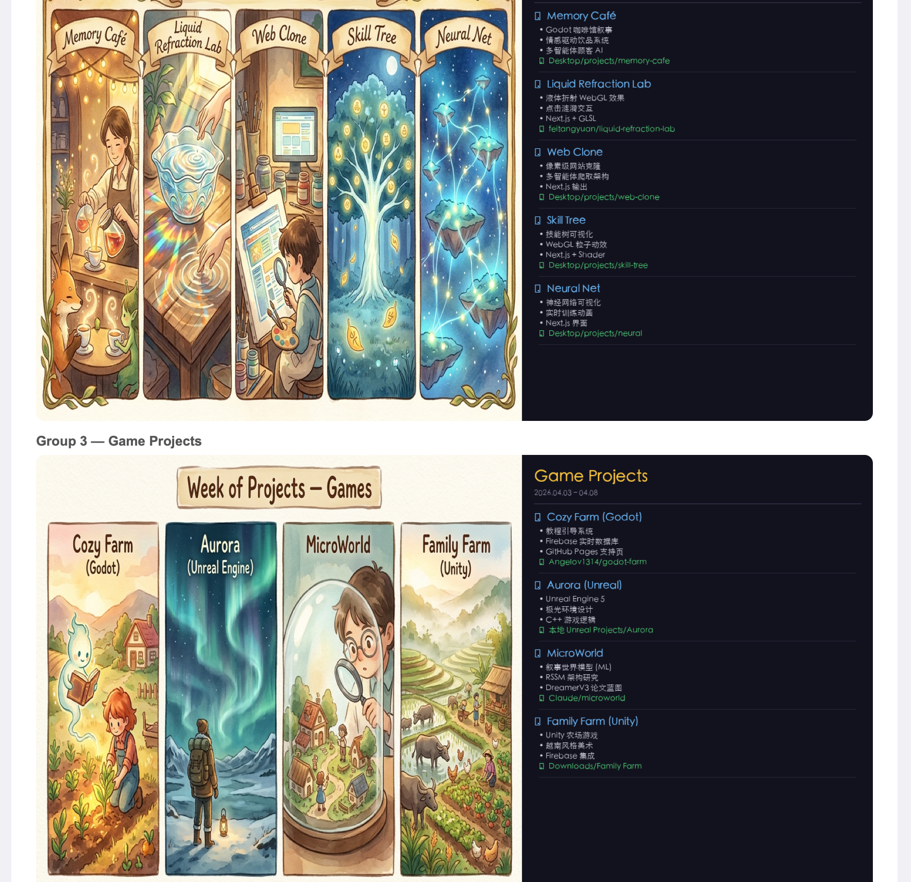
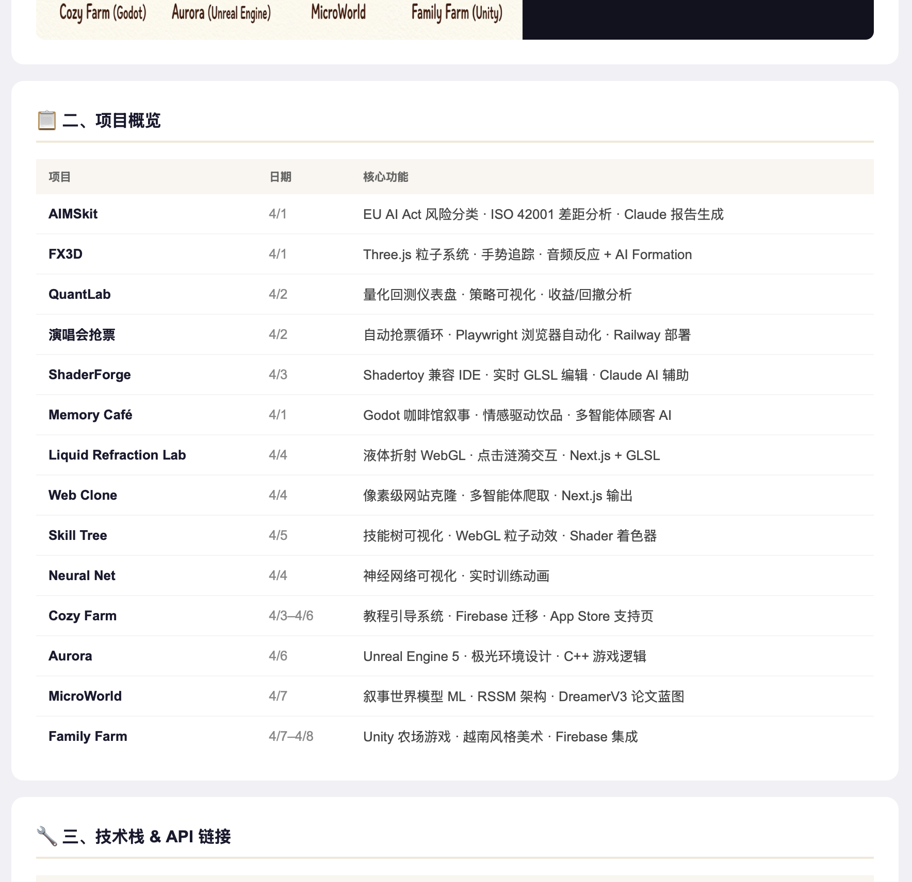
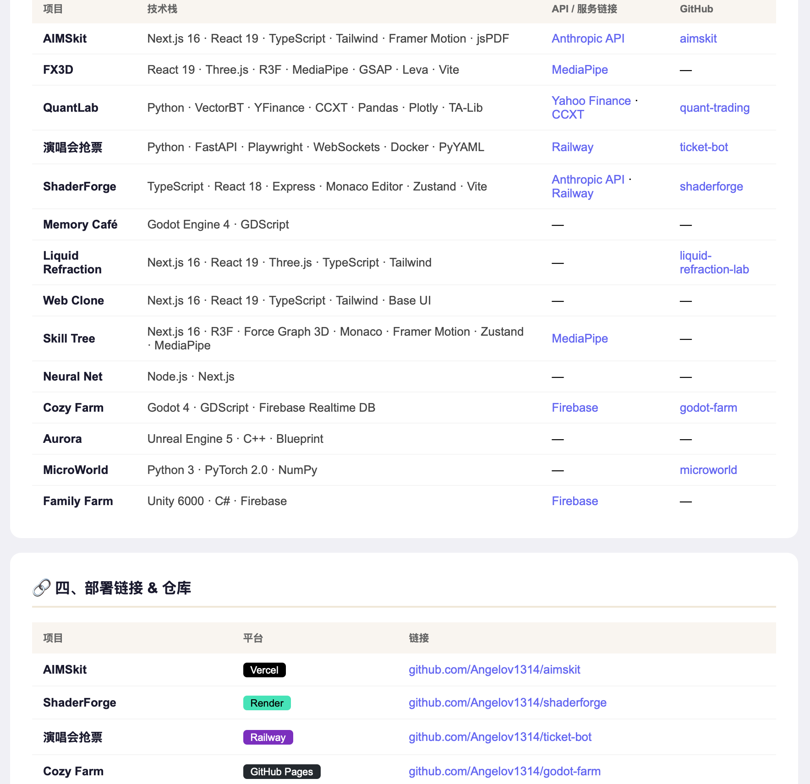
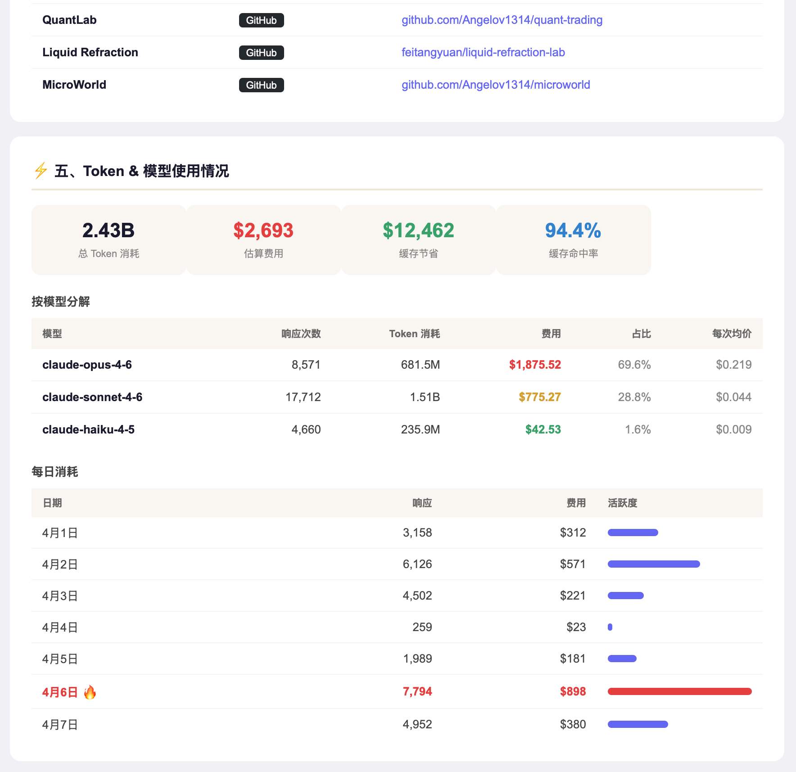

# Claude Weekly Usage Report







A Claude Code skill that generates a weekly project report with 5 sections — Ghibli-style art panels, project overview, tech stack + API links, deployment links, and token/model usage — sent as one Gmail email.

## What It Does

The `project-viz-report` skill scans your active projects, generates Studio Ghibli-inspired watercolor art panels via the Nano Banana API, collects token usage stats, and compiles everything into a single HTML email with 5 sections:

| # | Section | Content |
|---|---------|---------|
| 1 | Project Visualization | Ghibli art panels (3 groups of 5) hosted on GitHub |
| 2 | Project Overview | Name, date, core features table |
| 3 | Tech Stack & APIs | Tech stack, API services, GitHub repos |
| 4 | Deployment Links | Platform badges + live/repo URLs |
| 5 | Token Usage | Totals, per-model breakdown, daily bar chart |

## Installation

Copy the `project-viz-report` directory into your Claude Code skills directory:

```bash
mkdir -p ~/.claude/skills/project-viz-report
cp project-viz-report/skill.md ~/.claude/skills/project-viz-report/skill.md
```

## Usage

```
/project-viz-report
```

Claude will scan project directories, generate art panels, collect token usage, and draft a Gmail email with all 5 sections.

## Requirements

- Gmail MCP (for drafting/sending the email)
- Nano Banana API key (for Ghibli art generation)
- `token-usage` skill (for section 5 data)

---

## 中文说明

Claude Code 周报自动生成工具 — 一键扫描所有本地项目，生成包含 5 个模块的 HTML 邮件周报。

### 功能

| # | 模块 | 内容 |
|---|------|------|
| 1 | 项目可视化 | 吉卜力水彩风格项目插画（通过 Nano Banana API 生成） |
| 2 | 项目概览 | 项目名称、开发周期、核心功能列表 |
| 3 | 技术栈 & API | 使用的技术栈、API 服务、GitHub 仓库链接 |
| 4 | 部署链接 | 各平台部署状态 + 在线地址 |
| 5 | Token 用量 | 总消耗、按模型分类统计、每日用量柱状图 |

### 使用方法

```bash
# 安装 skill
mkdir -p ~/.claude/skills/project-viz-report
cp project-viz-report/skill.md ~/.claude/skills/project-viz-report/skill.md

# 在 Claude Code 中运行
/project-viz-report
```

### 依赖

- Gmail MCP（用于发送邮件）
- Nano Banana API key（用于生成吉卜力风格插画）
- `token-usage` skill（用于获取第 5 模块的数据）

## License

MIT
